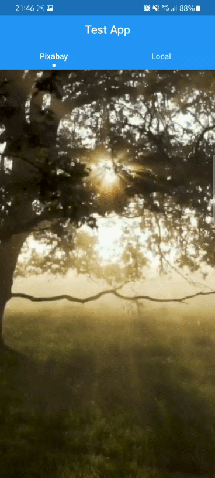
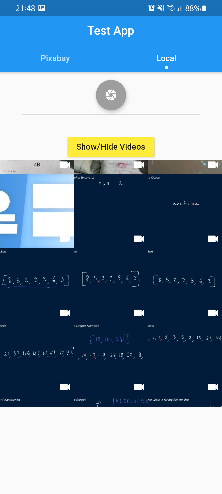

# pixabay - An Instagram Reels mockup app

This app is built to emulate the similar features of Instagram Reels. That allow the user to vertically scroll through lots of videos. 

## Basic Features

* Plays Videos one at a time.
* Vertically scrollable list of videos to access
* Pause and play functinality
* Fetching the Videos in real time from the pixabay server using API (please note that some videos do not provide sound, so it's not a bug of the app. Rather the cause of the video provided by the server)
* Added functionality to browse and select local videos for uploading. (The videos don't get uploaded anywhere yet)

## Screenshots

* Showing the Main Screen   

The Second Screen that queries local videos and shows for uploading  
  
